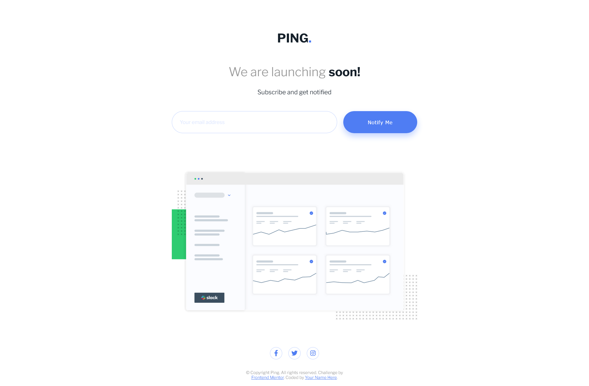

# Frontend Mentor - Ping coming soon page solution

This is a solution to the [Ping coming soon page challenge on Frontend Mentor](https://www.frontendmentor.io/challenges/ping-single-column-coming-soon-page-5cadd051fec04111f7b848da). Frontend Mentor challenges help you improve your coding skills by building realistic projects.

## Table of contents

- [Frontend Mentor - Ping coming soon page solution](#frontend-mentor---ping-coming-soon-page-solution)
  - [Table of contents](#table-of-contents)
  - [Youtube video](#youtube-video)
  - [Overview](#overview)
    - [The challenge](#the-challenge)
    - [Screenshot](#screenshot)
    - [Links](#links)
  - [My process](#my-process)
    - [Built with](#built-with)
    - [What I learned](#what-i-learned)
    - [Useful resources](#useful-resources)
  - [Author](#author)

## Youtube video

[](https://www.youtube.com/watch?v=sap0MJCC1oA)

## Overview

### The challenge

Users should be able to:

- View the optimal layout for the site depending on their device's screen size
- See hover states for all interactive elements on the page
- Submit their email address using an `input` field
- Receive an error message when the `form` is submitted if:
  - The `input` field is empty. The message for this error should say _"Whoops! It looks like you forgot to add your email"_
  - The email address is not formatted correctly (i.e. a correct email address should have this structure: `name@host.tld`). The message for this error should say _"Please provide a valid email address"_

### Screenshot



### Links

- [Live Site](https://thabeanboy.github.io/Front-End-Mentor-Ping-Coming-Soon-Page/)
- [Repo](https://github.com/ThaBeanBoy/Front-End-Mentor-Ping-Coming-Soon-Page)

## My process

### Built with

- Semantic HTML5 markup
- CSS custom properties
- Flexbox
- CSS Grid
- Desktop-first workflow
- [Font Awesome](https://fontawesome.com/)

### What I learned

The one difficult thing was deciding between spreading the elements equally vertically or letting the body overflow the user's screen. The original design was designed with a 1440x1024 sreen in mind. This site had to be responsive, so if I used flexbox and spread the elements equally, The site would've looked weird on smaller screens. I decided to let the body exceed the height of the user's screen should the body overflow the height of the screen.

In the case that the body didn;t overflow the body, I set the minimum height to 100vh, That way, at a minimum, the body would atleast cover the screen.

```css
body {
  min-height: 100vh;
}
```

In order to show errors in the user's input, I'd use the invalid css property of a input element. Using this allowed me to style the input when the value of the input is invalid. Using the same technique as before, I could also let the error message of the input be displayed based on the validity of the user's input.

```css
input:invalid {
  border-color: var(--Colour-Light-Red);
}

input:invalid + .input-err {
  display: block;
}
```

### Useful resources

- [Google Fonts](https://fonts.google.com/) - I usually use this to get typefaces
- [Font Awesome](https://fontawesome.com/) - Using their cdn, I could easily put icons in the project.
- [cdnjs](https://cdnjs.com/) - Tjis is the place I usually get my font awesom cdn from.

## Author

- Github - [@ThaBeanBoy](https://github.com/ThaBeanBoy)
- Frontend Mentor - [@yourusername](https://www.frontendmentor.io/home)
- Instagram - [@tiin_giib_chiip](https://www.instagram.com/tiin_giib_chiip/)
